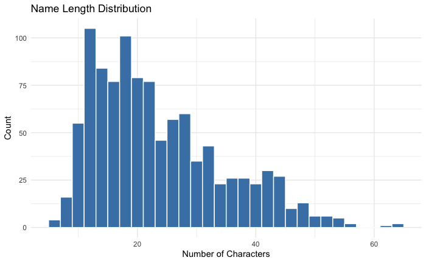
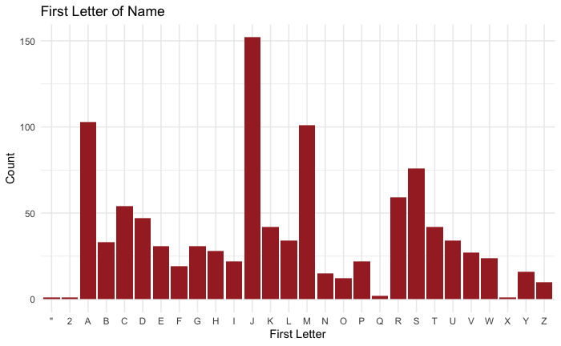

# Name Prediction App
This Shiny application was created for the stats-418 final project. 

The application is created for fun, no intention to show there is a causal relationship between names and variables including crime. 

The Shiny web App provides and interactive web page were you can input a name and predict different variables. 
The website can be accessed [here](https://finalproject-app-883217264014.us-west1.run.app).

The app uses an API created using Flask API, Docker and Google Cloud Run. The Shiny App is created in R, and deploied using Docker and Google Cloud Run.

## Repository Structure

| Directory | Description |
|----------------|-------------|
| `API/` | Files used to create a Docker image of the Flask API |
| `plots/` | plots used for EDA. Can be ignored. |
| `shiny_apps_R/` | Files to create a Docker image of the Shiny app in R |

## Data
The [FBI Wanted API](https://www.fbi.gov/wanted/api) was used to create a dataset that includes real-life names with different information. The API returns the most up-to-date public list of wanted fugitives and persons of interest.

The API includes:
  - Name
  - Gender
  - Race
  - Nationality
  - Date of Birth
  - Subject (Reason to be on list)

Race and Nationality were excluded from the dataset to avoid potential ethical concerns.

This API was used since it is hard to access a real-life dataset that includes actual names of individuals, and their personal information. 

Using the "Name" variable, characteristics shown below were computed.
  - Name length
  - Number of words
  - Vowel ratio
  - Consonant ratio
  - First letter of name

These Characteristics were used as predictors for the model.

## Exploratory Data Analysis

Some of the plots used for EDA is shown below.

## Models

### 1. Random Forest Predictor
The five name characteristics were used to predict the Birth Month, Gender, Age and Subject (reason to be on list). Since the main objective of this project was not the statistical model, a simple RandomForest model was used. RandomForest classifier for Birth month, Gender and Subject, a RandomForest regression for Age was used. 

The building of the model can be found in `API/prediction.py`.

### 2. KNN Similar Name finder
KNN was conducted on the dataset using the same name characteristics to show a similar name under the specified characteristics. The model was deployed inside the Shiny-app server.

The building of the model can be found in `shiny_app_R/app.py`.

## Local Deployment

The instruction to deploy the Shiny App and API can be found in the `README.md` in each of their directories. Both are hosted on separate Google Cloud Run services, using Docker hub.

## Lastly

This project was made to try creating APIs, and deploying a interactable web app that can be accessed online. The model was not created to have high predictions. Please bear in mind that the topic itself was chosen just for fun :) 

